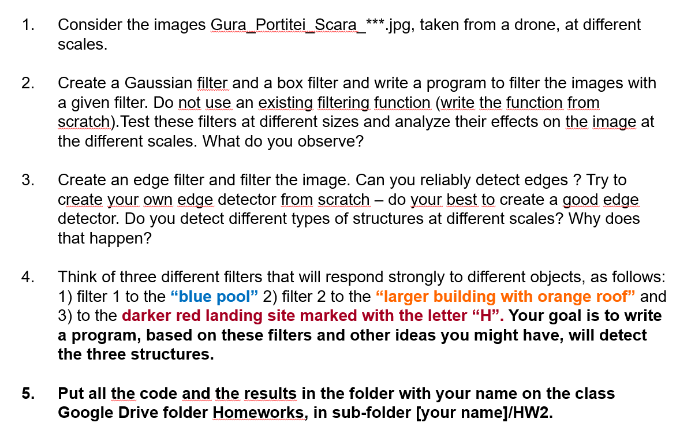

# HW2 Image Processing Project

This project contains image processing tasks such as color filtering and edge detection. The project automatically detects features in images, processes them using custom filters, and outputs the results.

## Project Structure
- `code/` contains the Python scripts for edge detection and color filtering.
- `images/` is where the input images are stored.
- `results/` is where the output images will be saved. The folder is generated after running the code.

## Requirements
- Python 3.x
- `pip` (Python package installer)

## Setup Instructions
Follow the steps below to set up and run the project:

1. **Navigate to the project directory**:
    ```bash
    cd CV-HW2
    ```

2. **Run the `run.bat` file** to automatically create a virtual environment, install dependencies, and run the color filtering script:
    ```bash
    run.bat
    ```

    This will:
    - Set up a virtual environment.
    - Install the required packages.
    - Run the `color_filters.py` script.

3. **Running other scripts**:
    - To run the edge detection script (`edge_detection_filter.py`), activate the virtual environment and run:
      ```bash
      venv\Scripts\activate
      python CODE\edge_detection_filter.py
      ```

## File Descriptions
- `color_filters.py`: Applies color filters to images and saves the results in the `results/color_filter` directory.
- `edge_detection_filter.py`: Detects edges in images using Sobel and Laplacian filters and saves the results in the `results/edge_detection` directory.

## Output
- The output images are saved in the `results/` directory with subfolders based on the scale of the images and type of processing.
